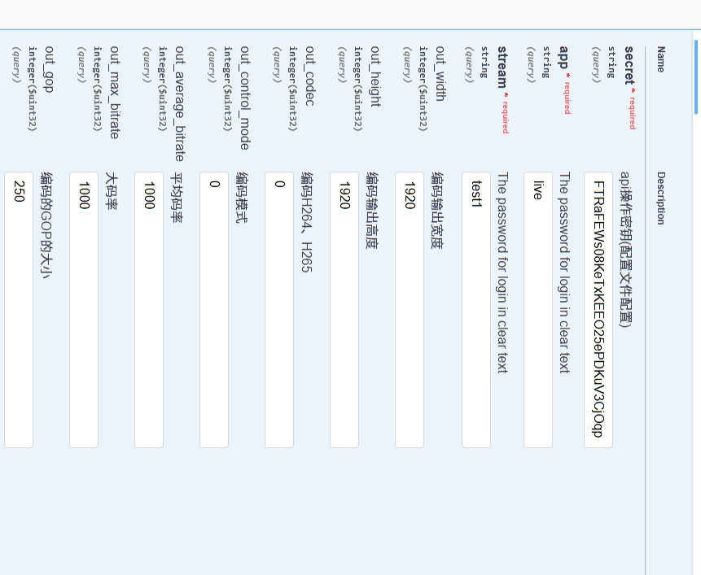

# 媒体服务转码版本GPU加速转码（NVENC/NVDEC/CUDA/瑞芯微/海思MPP） 支持H264与H265转码

 
## 一、功能说明
 
1. 视频间任意转码的GPU加速转码（NVENC/NVDEC/CUDA/瑞芯微/海思MPP）
2. 基于http api的动态增减转码，支持设置比特率，分辨率倍数，codec类型、滤镜等参数
3. 支持全GPU硬件编解码与滤镜，防止显存与内存频繁拷贝
4. 支持视频全GPU(CUDA/NPU)推理插件，支持人员、车辆等目标AI识别，支持目标跟踪 


## 二、接口调用参数说明

api接口参数:

 


```javascript 

curl -X 'GET' \
  'http://127.0.0.1/index/api/set_transcode_info?secret=FTRaFEWs08KeTxKEEO25ePDKuV3CjOqp&app=live&stream=test1&out_width=1920&out_height=1920&out_codec=0&out_control_mode=0&out_average_bitrate=1000&out_max_bitrate=1000&out_gop=250&out_i_qp=28&out_p_qp=35' \
  -H 'accept: application/json'
  
  
  

```


